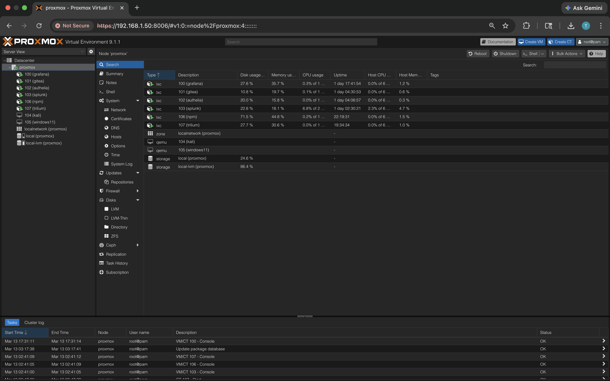
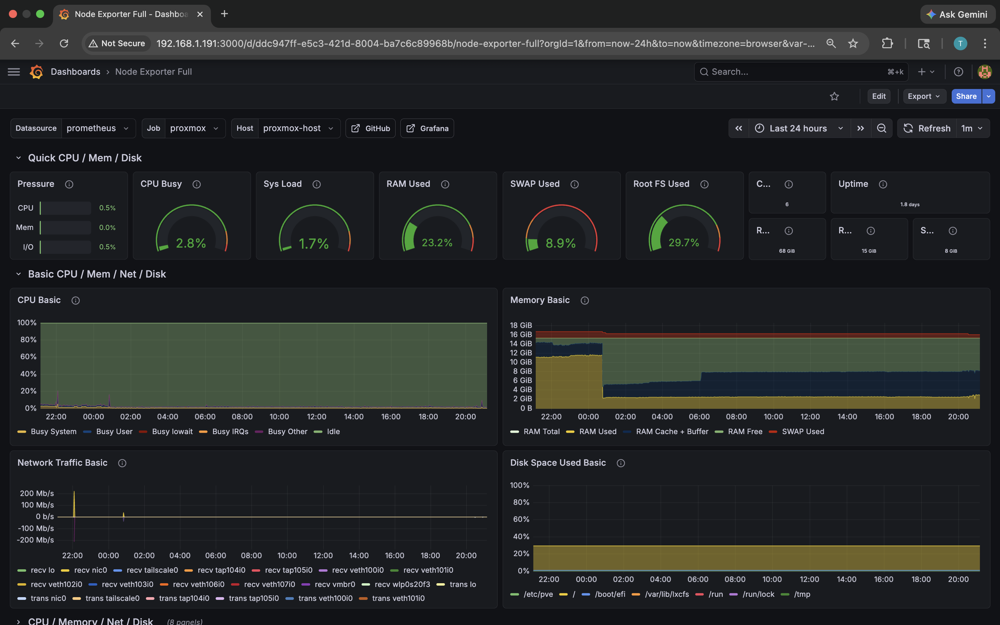
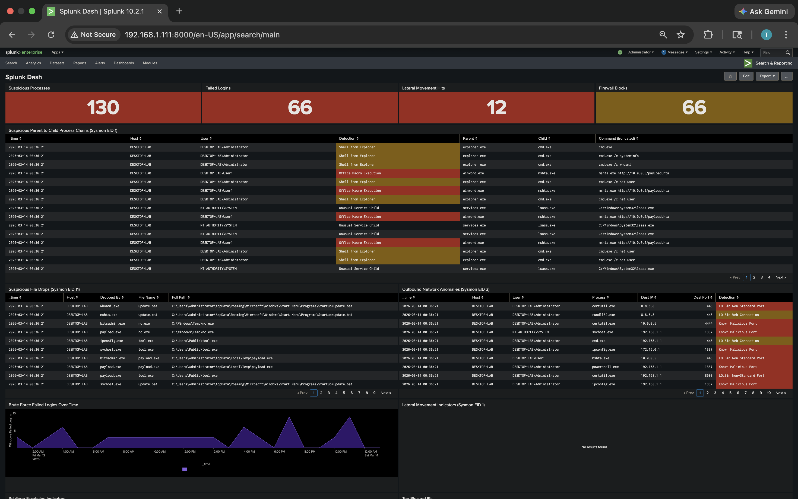
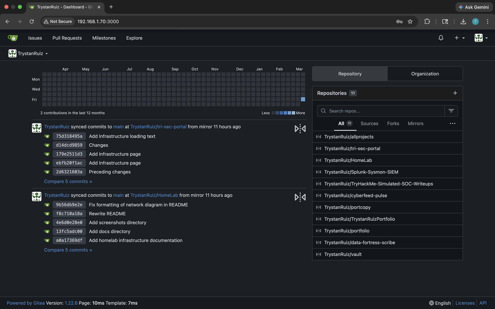
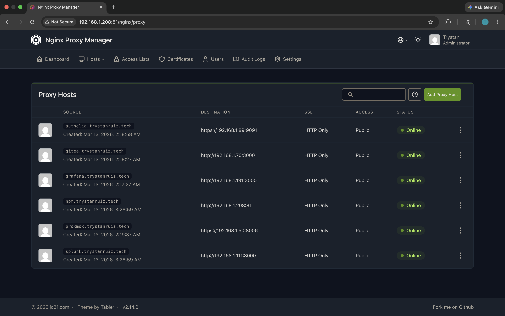
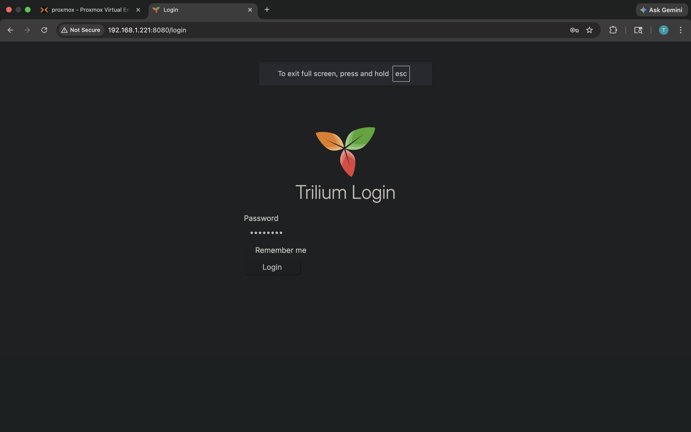
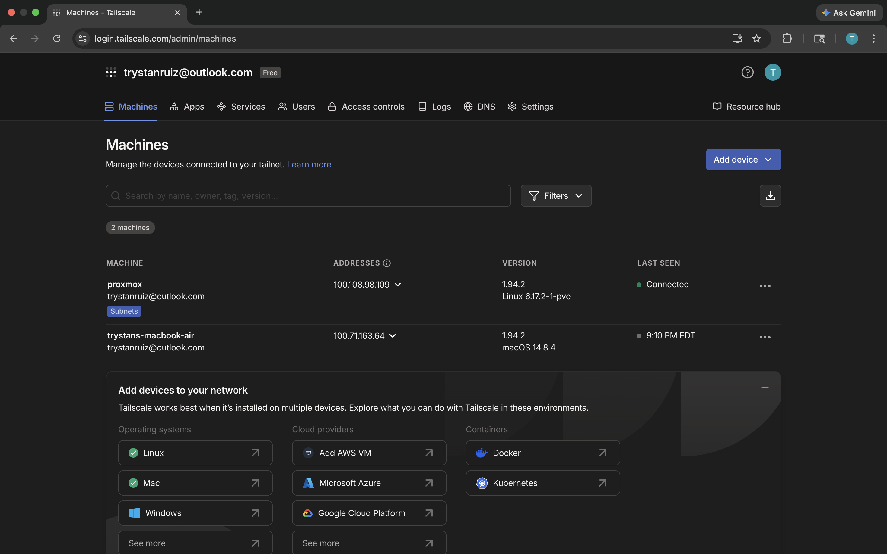

Junior at UCF studying Information Technology. CompTIA Security+ certified, Network+ and CySA+ in progress. Focused on blue team, security monitoring, and building things hands-on. Currently looking for internships, feel free to look around.

---

# HomeLab

A home server running Proxmox VE with a handful of self-hosted services — Gitea, Splunk, Grafana, Nginx Proxy Manager, Authelia, and Trilium. Services run as LXC containers on a single node with remote access set up through Tailscale. Built and configured everything from scratch including the networking, storage, and a Splunk SOC dashboard with Sysmon detections.

---

## Infrastructure

**Host:** Proxmox VE 9.1 — 6 cores, 16GB RAM, 68GB SSD + LVM storage  
**Network:** All services on 192.168.1.0/24, remote access via Tailscale subnet routing  
**OS:** Debian 12 (LXC containers), Kali Linux 2025.4 (VM), Windows 11 (VM)

| ID | Hostname | IP | Service |
|----|----------|----|---------|
| CT 100 | grafana | 192.168.1.191 | Grafana + Prometheus |
| CT 101 | gitea | 192.168.1.70 | Gitea (self-hosted Git) |
| CT 102 | authelia | 192.168.1.89 | Authelia SSO |
| CT 103 | splunk | 192.168.1.111 | Splunk Enterprise SIEM |
| CT 106 | npm | 192.168.1.208 | Nginx Proxy Manager |
| CT 107 | trilium | 192.168.1.221 | Trilium Notes |
| VM 104 | kali | 192.168.1.54 | Kali Linux 2025.4 |
| VM 105 | windows11 | DHCP | Windows 11 Home |

---

## Proxmox

Proxmox VE handles all the virtualization. Containers run as unprivileged LXC with systemd namespace overrides. VMs use QEMU/KVM. Storage is split between local (ISOs, templates) and local-lvm (thin provisioned container/VM disks).



---

## Grafana + Prometheus

Grafana pulls metrics from Prometheus which scrapes Node Exporter running on the Proxmox host. Gives real-time visibility into CPU, memory, disk, and network across the whole server.



---

## Splunk SIEM

Splunk Enterprise ingesting Windows Security event logs, Sysmon telemetry, firewall logs, and web server access logs. Built a custom SOC dashboard with detections for:

- Suspicious process chains (parent/child analysis)
- LOLBin abuse — certutil, bitsadmin, mshta, rundll32
- Encoded PowerShell and download cradles
- lsass memory access attempts
- Lateral movement indicators (PsExec, WMI, PS Remoting)
- Privilege escalation patterns
- Brute force login tracking
- Outbound network anomalies (C2 ports, LOLBin connections)

MITRE ATT&CK technique IDs mapped to each detection.



---

## Gitea

Self-hosted Git server. All personal projects and lab configs live here, mirrored to GitHub. Runs on Debian 12 LXC, ~200MB RAM usage at idle.



---

## Nginx Proxy Manager

Reverse proxy for all internal services. Each service gets a subdomain under trystanruiz.tech with DNS managed through Nginx Proxy Manager. All proxy hosts visible in the dashboard, currently HTTP only (internal network only, not public facing).



---

## Trilium Notes

Self-hosted note-taking and knowledge base. Used for lab documentation, runbooks, and notes. Runs on Node.js in a Debian 12 LXC container.



---

## Tailscale

Tailscale installed on the Proxmox host advertising the full 192.168.1.0/24 subnet. From any device with Tailscale running, all homelab services are accessible by LAN IP without any port forwarding or VPN config. Two machines currently in the tailnet — the Proxmox host and my MacBook.



---

## Networking

```
Internet
    |
 Router (192.168.1.1)
    |
 Proxmox Host (192.168.1.50)
    |-- vmbr0 (Linux bridge)
         |-- CT 100  grafana     192.168.1.191
         |-- CT 101  gitea       192.168.1.70
         |-- CT 102  authelia    192.168.1.89
         |-- CT 103  splunk      192.168.1.111
         |-- CT 106  npm         192.168.1.208
         |-- CT 107  trilium     192.168.1.221
         |-- VM 104  kali        192.168.1.54
         |-- VM 105  windows11   DHCP

Remote Access: Tailscale (subnet router on Proxmox)
```

---

## Planned

- Wire up Authelia to protect services behind SSO
- Connect Splunk to live log sources (syslog from containers, SSH auth logs)
- Set up alerting in Grafana for resource thresholds
- Cloudflare Zero Trust when going public-facing
